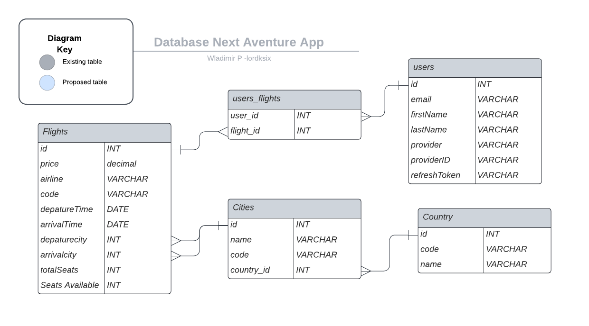

<a id="readme-top"></a>

<div align="center">
    
</div>

<div align="center">
    
</div>

<h1 align="center"><b>DocConnect</b></h3>

# 📗 Table of Contents

- [📗 Table of Contents](#table-of-contents)
- [📖 Budget by Lordksix](#about-project)
  - [🛠 Built With](#built-with)
    - [Tech Stack](#tech-stack)
    - [Key Features](#key-features)
  - [🚀 Live Demo](#live-demo)
  - [💻 Getting Started](#getting-started)
    - [Prerequisites](#prerequisites)
    - [Setup](#setup)
    - [Install](#install)
    - [Usage](#usage)
    - [Run tests](#run-tests)
  - [👥 Authors](#Authors)
  - [🔭 Future Features](#future-features)
  - [🤝 Contributing](#contributing)
  - [⭐️ Show your support](#️support)
  - [🙏 Acknowledgments](#acknowledgements)
  - [❓ FAQ](#faq)
  - [📝 License](#license)

# 📖 Next Adventure App <a id="about-project"></a>

**Next Adventure App** is the back end of the Next Adventure App. Build using NestJS and PostgreSQL as database. It allows you to look for and book flights and login with Facebook and GOogle.

<a href="https://github.com/lordksix/nextadventure-frontend.git">Link to Front End Repository</a>


<p align="right">(<a href="#readme-top">back to top</a>)</p>

## 🛠 Built With <a id="built-with"></a>

### Tech Stack <a id="tech-stack"></a>

<details>
  <summary>Server</summary>
  <ul>
    <li><a href="https://nestjs.com/">NestJS</a></li>
    <li><a href="https://nodejs.org/en">Node.js</a></li>
  </ul>
</details>

<details>
  <summary>Database</summary>
  <ul>
    <li><a href="https://www.postgresql.org/">PostgreSQL</a></li>
  </ul>
</details>

### Key Features <a id="key-features"></a>

- **Gitflow**
- **Implement Model Migrations**
- **Setup JWT**
- **Setup Guards**
- **Implement authentication**
- **Use PostgreSQL**
- **Implement Factory builder and seeders**

<p align="right">(<a href="#readme-top">back to top</a>)</p>

## 🚀 Live Demo <a name="live-demo"></a>

> The backend is being deploy to  [Live Demo](https://next-adventure-lordksix.onrender.com).

<p align="right">(<a href="#readme-top">back to top</a>)</p>

## 💻 Getting Started <a id="getting-started"></a>

### Prerequisites

In order to run this project you need:

- To clone or fork this repo
- Have Nest CLI install and Node.js
- PostgreSQL install in you computer
- To modify this profile you will also need a text editor

For more information on how to install ruby on your machine:

- <a href="https://nodejs.org/en">How to install Node.js</a>
- <a href="https://docs.nestjs.com/">How to install Nestjs</a>

### Setup

Clone this repository to your desired folder:

For example, using Ubuntu:

```sh
  cd my-desired-folder
  git clone https://github.com/lordksix/NextAdventure-backend.git
```

For more information on how to clone or fork a repository:

- <a href="https://docs.github.com/en/repositories/creating-and-managing-repositories/cloning-a-repository">How to clone a repo</a>
- <a href="https://docs.github.com/en/get-started/quickstart/fork-a-repo">How to fork a repo</a>

### Install

To install dependencies, the following command must be run in the terminal:

```sh
  cd NextAdventure-backend
  npm i
```

Run:

```bash
cp .env.example .env
```

Update DATABASE_PG_PASSWORD and SESSION_SECRET in .env file

To create database, migrate schema and implement initial database entries

```sh
  npm run db:create && npm run migrations:run && npm run reseed
```

### Usage

In the project directory, run:

```sh
  npm run start:dev
```

### Run tests

No tests implemented

<p align="right">(<a href="#readme-top">back to top</a>)</p>

## 👥 Authors <a id="Authors"></a>

👤 **lordksix**

- GitHub: [@lordksix](https://github.com/lordksix)
- LinkedIn: [@wladpasquel](https://www.linkedin.com/in/wladpasquel/)
- Medium: [@wladimir.pasquel](https://medium.com/@wladimir.pasquel)


<p align="right">(<a href="#readme-top">back to top</a>)</p>

## 🔭 Future Features <a id="future-features"></a>

Future changes:

- Implement loca user and authentication.
- Improve security using JWT.
- Implement testing

<p align="right">(<a href="#readme-top">back to top</a>)</p>

## 🤝 Contributing <a id="contributing"></a>

Contributions, issues, and feature requests are welcome!

Feel free to check the [issues page](../../issues/).

<p align="right">(<a href="#readme-top">back to top</a>)</p>

## ⭐️ Show your support <a id="️support"></a>

If you like this project, I encourage you to clone, fork and contribute. Our community and knowledge grows with each engagement.

<p align="right">(<a href="#readme-top">back to top</a>)</p>

## 🙏 Acknowledgments <a id="acknowledgements"></a>

- Life is awesome!!!

<p align="right">(<a href="#readme-top">back to top</a>)</p>

<p align="right">(<a href="#readme-top">back to top</a>)</p>

## 📝 License <a id="license"></a>

This project is [GNU v3](./LICENSE) licensed.

<p align="right">(<a href="#readme-top">back to top</a>)</p>
